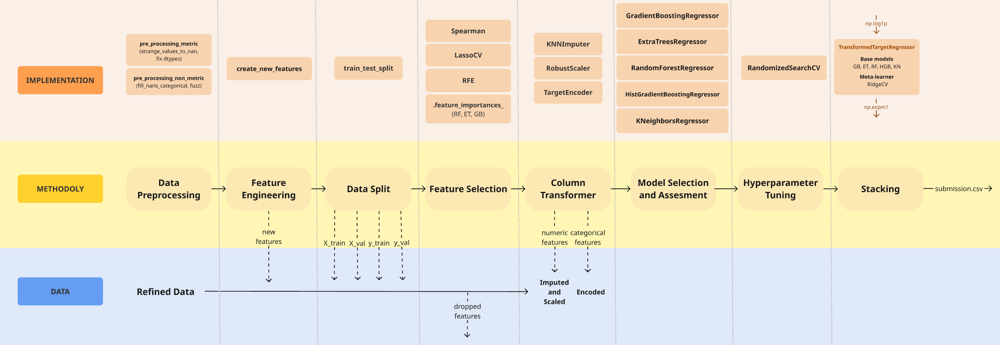

# Cars 4 You – Expediting Car Evaluations with Machine Learning

## Project Context

This project was developed as part of the **Machine Learning** course. The goal is to support the fictitious company **Cars 4 You**, an online car resale platform, by building a **machine learning model to automatically estimate used car prices** based solely on user-provided information, reducing the need for physical mechanical inspections.

The project uses a subset of real-world data from 2020 and follows a complete **end-to-end Machine Learning pipeline**, implemented in a single notebook.

---

## Objectives

1. **Regression Benchmarking** – Develop and compare multiple regression models to predict car prices.
2. **Model Optimization** – Improve model performance through preprocessing, feature selection, and hyperparameter tuning.
3. **Additional Insights** – Analyze feature importance and assess the impact of different pipeline components.
4. **Deployment** – Build a reusable pipeline capable of generating predictions for new, unseen data.

---

## Repository Structure

```
├── hold-out_pymoded.ipynb        # Single notebook containing the full pipeline
├── functions_group23.py          # Core file with all preprocessing, feature engineering, feature selection and modeling functions
├── train.csv                     # Training dataset (must be in the same folder as the notebook)
├── test.csv                      # Test dataset (must be in the same folder as the notebook)
├── kaggle_submission.csv         # Final predictions for Kaggle submission
└── README.md
```

> All files are expected to be in the **same directory** to ensure the notebook runs from start to finish without path issues.

---

## Machine Learning Pipeline

All reusable logic is implemented in `functions_group23.py` and imported into the notebook to ensure consistency and avoid code duplication. The flowchart of the pipeline is illustred bellow:

<p align="center">
  
</p>

### 1. Data Exploration and Cleaning

* Statistical analysis and anomaly detection
* Handling invalid or inconsistent values (e.g. mileage ≤ 0, unrealistic mpg values)
* Type conversion and removal of non-deployable features

### 2. Preprocessing

* Categorical data cleaning using **fuzzy matching** (RapidFuzz)
* Exploratory data analysis
* Numeric feature imputation and scaling (used for feature selection)
* Feature engineering 

### 3. Feature Selection

* Spearman correlation analysis
* Lasso regression
* Recursive Feature Elimination (RFE)
* Tree-based feature importance (Random Forest, Extra Trees, Gradient Boosting)

### 4. Modeling

Tested models include:

* Linear Regression
* Lasso Regression
* Random Forest Regressor
* Extra Trees Regressor
* Gradient Boosting Regressor
* Stacking ensembles

### 5. Evaluation

* Strategy: **Hold-out validation**
* Metrics:

  * R²
  * MAE
  * RMSE

### 6. Optimization

* Hyperparameter tuning using RandomizedSearchCV
* Performance comparison between baseline and optimized models

---

## Results

* Tree-based models and stacking ensembles achieved the strongest performance
* Features such as **model**, **power_efficiency**, and **car_age** were consistently among the most important
* **Public Kaggle score:** MAE = **1180**
* The final pipeline demonstrated good generalization performance on the Kaggle test set

---

## Deployment

The final solution includes a deployment-ready pipeline that:

* Accepts new data in the original dataset format
* Applies all preprocessing steps automatically
* Generates reliable price predictions
* Produces a `.csv` file ready for Kaggle submission

---

## Open-Ended Section

The open-ended component of this project focuses on **model interpretability and pipeline analysis**.

The following aspects were explored:
- Comparative analysis of feature importance across multiple model families (linear vs tree-based)
- Evaluation of the impact of engineered features
- Assessment of how preprocessing and feature selection influence overall model performance

These analyses were used to support model selection decisions

---

## Reproducibility

To run the project end-to-end:

1. Clone the repository
2. Place `train.csv`, `test.csv`, and `functions_group23.py` in the same directory as the notebook
3. Run `hold-out_pymoded.ipynb` from start to finish

---

## Main Libraries

* numpy
* pandas
* scikit-learn
* matplotlib
* seaborn
* scipy
* rapidfuzz
* tqdm

---

## Final Notes

This project was developed strictly for academic purposes. All preprocessing, modeling, and evaluation decisions are explicitly justified in the notebook, in compliance with the course rules.

